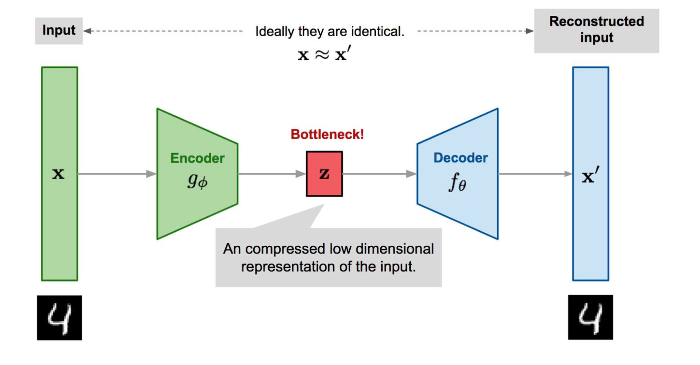
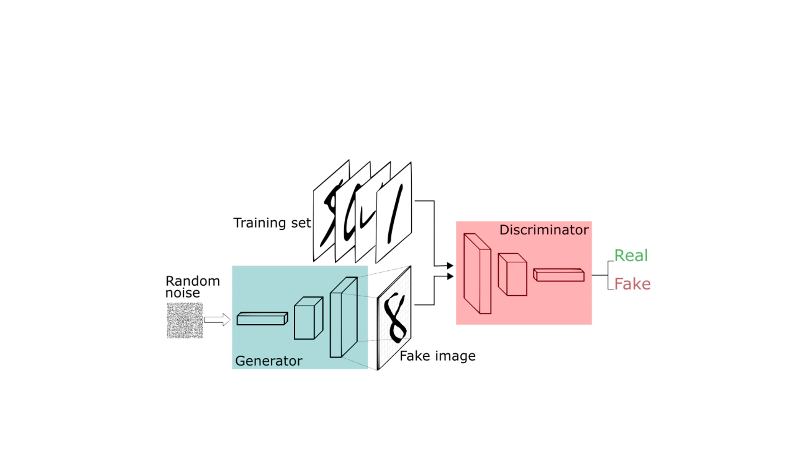
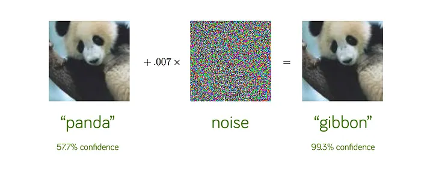
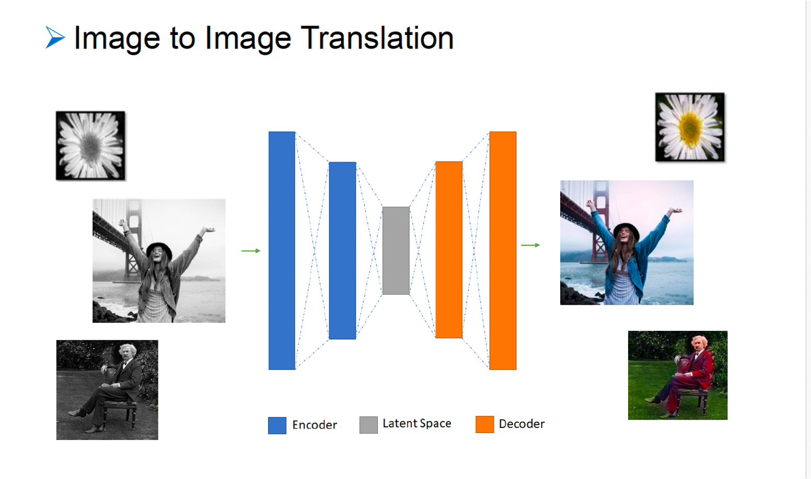
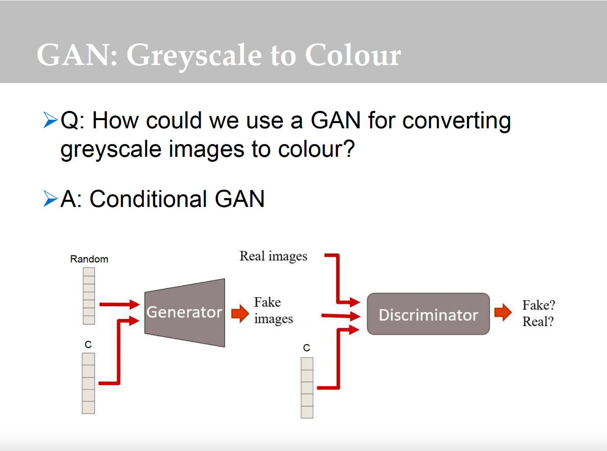

# Generative Deep Learning with PyTorch

A collection of practical **Generative Deep Learning** projects implemented using **PyTorch**. This repository explores representation learning, synthetic image generation, and model robustness through Autoencoders, Generative Adversarial Networks (GANs), adversarial attacks, and modern generative modeling techniques. Each notebook has been reorganized, documented, and expanded to demonstrate practical deep learning workflows for generative AI.


---

# 🚀 Repository Overview

This repository contains practical generative deep learning projects built with **PyTorch**, covering autoencoders, generative adversarial networks, adversarial robustness, and image generation through reproducible, well-documented notebooks.

---

# ✨ Project Highlights

- Autoencoders and Variational Autoencoders (VAEs)
- Convolutional Autoencoders
- Generative Adversarial Networks (GANs)
- Conditional GANs (cGANs)
- Image colorization using CNNs and GANs
- Adversarial attack techniques for evaluating model robustness
- GPU-ready training pipelines
- Well-documented notebooks suitable for learning and experimentation

---

# 📚 Topics Covered

- Convolutional Autoencoder
- Convolutional Autoencoders
- Latent space representation learning
- Image reconstruction
- Generative Adversarial Networks (GANs)
- Generator and Discriminator architectures
- Synthetic image generation
- Adversarial attacks
- Model robustness
- Deep generative models
- PyTorch implementation
- GPU acceleration with CUDA
- Deep learning best practices
- Variational Autoencoders (VAEs)
- Conditional GANs (cGANs)

---

# 🛠️ Technologies

- Python
- PyTorch
- Torchvision
- NumPy
- Matplotlib
- Scikit-learn
- Pillow (PIL)

---

# 📂 Repository Structure

```text
generative-deep-learning-pytorch/
│
├── README.md
├── requirements.txt
├── .gitignore
│
├── notebooks/
│   ├── 01_autoencoder.ipynb
│   ├── 02_gan.ipynb
│   ├── 03_adversarial_attacks.ipynb
│   └── 04_image_colorization.ipynb
│
├── Images/
│   ├── Colorization.jpg
│   ├── ColorizationGANs.png
│   ├── ColorizationVAEs.png
│   ├── Gans.jpg
│   ├── Adversarial_Attacks.jpg
│   └── autoencoder_overview.png
│
└── models/
```

---


# 📖 Notebooks


## Notebook 1 — Autoencoders and Variational Autoencoders

<table>
<tr>
<td align="center" width="50%">



**Autoencoders**

</td>

<td align="center" width="50%">


**Variational Autoencoder (VAE)**

</td>
</tr>
</table>

### Overview

This notebook introduces modern autoencoder architectures for unsupervised representation learning using PyTorch. It explores fully connected autoencoders, convolutional autoencoders, and variational autoencoders (VAEs), demonstrating how neural networks learn compact latent representations, reconstruct images, and generate new samples from learned probability distributions.

### Topics Covered

- Fully Connected Autoencoders
- Convolutional Autoencoders
- Variational Autoencoders (VAEs)
- Encoder–Decoder architectures
- Latent space representation learning
- Image reconstruction
- Image generation
- Transpose convolutions
- KL-divergence loss
- MNIST dataset
- Unsupervised learning

### Notebook

`notebooks/01_autoencoder.ipynb`


---

## Notebook 2 — Generative Adversarial Networks (GANs)

### Overview

This notebook explores **Generative Adversarial Networks (GANs)** for realistic image synthesis using PyTorch. It begins by examining the limitations of reconstruction-based autoencoders for image generation before introducing the adversarial learning framework. The notebook implements both standard GANs and Conditional GANs (cGANs), demonstrating how adversarial training enables the generation of high-quality synthetic images from random latent vectors and class-conditioned inputs.

<p align="center">
  
</p>

* Generative Adversarial Networks consist of a Generator that synthesizes images from random latent vectors and a Discriminator that learns to distinguish generated images from real images.*

### Topics Covered

- Generative Adversarial Networks (GANs)
- Conditional GANs (cGANs)
- Generator networks
- Discriminator networks
- Adversarial learning
- Latent space sampling
- Image synthesis
- Conditional image generation
- GAN training challenges
- MNIST dataset

### Notebook

`notebooks/02_gan.ipynb`

---

## Notebook 3 — Adversarial Attacks on Deep Neural Networks

### Overview

This notebook investigates adversarial attacks against deep neural networks using PyTorch. It demonstrates how small, carefully optimized perturbations can cause image classifiers to make incorrect predictions, highlighting important challenges in AI robustness and model security.



### Topics Covered

- Adversarial examples
- Targeted adversarial attacks
- Gradient-based optimization
- Adversarial perturbations
- Neural network robustness
- Model security
- Visualization of adversarial examples
- PyTorch implementation

### Notebook

`notebooks/03_adversarial_attacks.ipynb`

---

## Notebook 4 — Image Colorization with CNNs and Conditional GANs

<table>
<tr>
<td align="center" width="50%">



**Part A:** CNN-Based Image Colorization (Encoder–Decoder & U-Net)

</td>

<td align="center" width="50%">



**Part B:** Conditional GAN (cGAN) for Image Colorization

</td>
</tr>
</table>

### Overview

This notebook presents an end-to-end image colorization project implemented in **PyTorch**, bringing together the concepts introduced throughout the previous notebooks. It explores two complementary deep learning approaches for predicting realistic color images from grayscale inputs.

**Part A** formulates image colorization as a supervised image-to-image translation problem using convolutional encoder–decoder networks and U-Net architectures with skip connections.

**Part B** extends this approach by implementing a **Conditional Generative Adversarial Network (cGAN)**, where a generator learns to produce realistic color images while a discriminator encourages visually plausible outputs through adversarial training.

Together, these two approaches demonstrate both reconstruction-based and adversarial methods for image colorization.

### Topics Covered

- Image colorization
- Image-to-image translation
- Convolutional Neural Networks (CNNs)
- Encoder–Decoder architectures
- U-Net with skip connections
- Image regression
- Conditional GANs (cGANs)
- Generator and Discriminator architectures
- Adversarial learning
- CIFAR-10 dataset
- Deep learning with PyTorch

### Notebook

`notebooks/04_image_colorization.ipynb`

---

# 🎯 Learning Objectives

Throughout this repository, I explore how to:

- Build autoencoders for unsupervised representation learning.
- Learn compact latent representations of image data.
- Reconstruct images using encoder-decoder architectures.
- Train Generative Adversarial Networks (GANs) and Conditional GANs (cGANs) for image synthesis and image-to-image translation.
- Evaluate neural network robustness using adversarial attacks.
- Understand modern generative deep learning techniques.
- Develop complete generative AI workflows using PyTorch.

---


# 📈 Key Learning Outcomes

This repository demonstrates practical implementations of:

- Fully Connected Autoencoders
- Convolutional Autoencoders
- Variational Autoencoders (VAEs)
- Generative Adversarial Networks (GANs)
- Conditional GANs (cGANs)
- Adversarial attacks on deep neural networks
- Image colorization using CNNs and GANs
- Image-to-image translation

---

# 🚀 Getting Started

Clone the repository:

```bash
git clone https://github.com/Miladsaeedi70/generative-deep-learning-pytorch.git
```

Navigate to the project:

```bash
cd generative-deep-learning-pytorch
```

Install the required packages:

```bash
pip install -r requirements.txt
```

Launch Jupyter Notebook:

```bash
jupyter notebook
```

Open the notebooks in numerical order:

1. Autoencoders
2. Generative Adversarial Networks
3. Adversarial Attacks
4. Generative Modeling

---

# ⭐ About
This repository showcases practical implementations of modern generative deep learning techniques using PyTorch. Starting from representation learning with autoencoders and variational autoencoders, it progresses through generative adversarial networks, adversarial robustness, and concludes with an end-to-end image colorization project using both encoder–decoder networks and Conditional GANs.

The notebooks have been reorganized and modernized to improve readability, reproducibility, and compatibility with recent versions of PyTorch and Python.

---

# 📄 License

This repository is intended for educational and portfolio purposes.